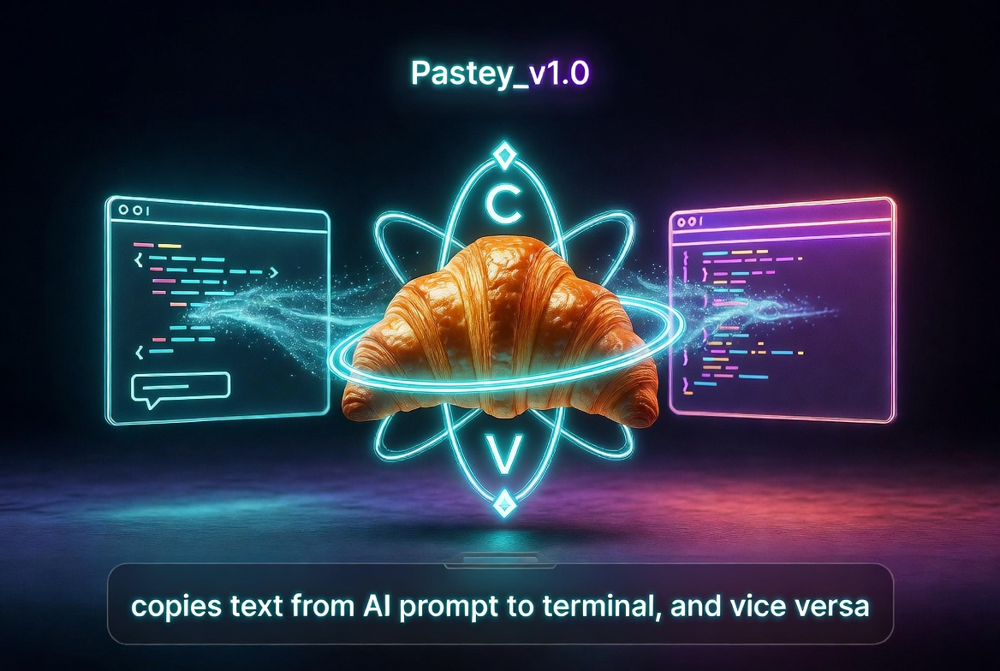

<p align="center">
  
</p>

<h1 align="center">Pastey_v1.0</h1>

<p align="center"><b>Stop copy-pasting between AI and terminal. Pastey_v1.0 does it for you.</b></p>

<p align="center">
  
  
  
</p>

---

## What it does

Copy a code block from your AI chat. Pastey_v1.0 detects it, confirms with you,
runs it in terminal, captures the output, and copies the result back to your
clipboard ready to paste straight back into the AI.

No more switching windows. No more manual copy-pasting. Just flow.

---

## How it works

```
AI chat window
     |
     |  you copy a code block
     v
  Pastey_v1.0
     |  detects it, confirms with you
     |  runs it in terminal
     |  captures output
     v
clipboard  <--  paste back into AI
```

---

## Features

- Supervised mode — confirms before running anything
- Auto hang detection — kills commands that freeze after 120s
- Error capture — grabs stderr and formats it for AI
- sudo detection — pauses and alerts you when password needed
- Safety filter — refuses dangerous commands like rm -rf /
- Max retry limit — stops after 3 failed attempts on same command
- Session stats — tracks runs, errors, skips per session

---

## Install

### System dependencies
```bash
sudo apt install xclip xdotool wmctrl -y
```

### Python dependencies
```bash
pip install -r requirements.txt
```

### Run
```bash
python3 pastey.py
```

---

## Requirements

| Requirement | Version |
|-------------|---------|
| Python | 3.10+ |
| OS | Linux (Ubuntu / Zorin / Debian) |
| Display | X11 |

---

## Buy

$9 lifetime license — [ko-fi.com/kron777](https://ko-fi.com/kron777)

Full auto mode, error auto-recovery, multi-terminal support.

---

<p align="center">
  
  <br/>
  <i>Built with coffee and too much copy-pasting</i>
</p>
